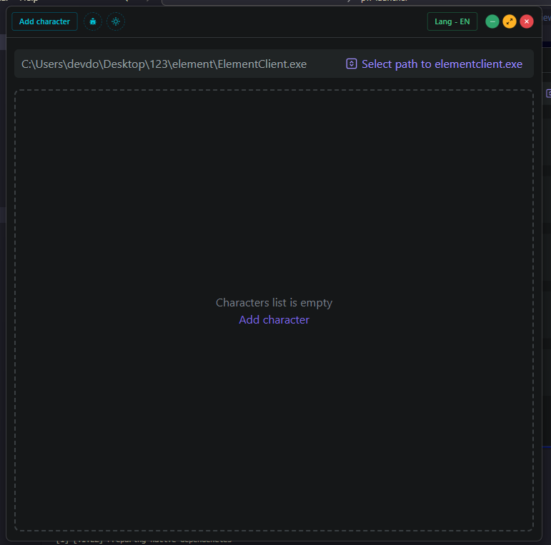
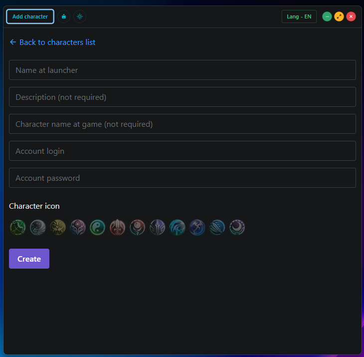
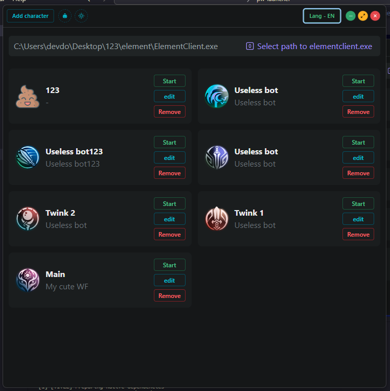

# PW Launcher

Launcher for any Perfect World free server (with autorename window) <br />
Just select your elementclient.exe, add characters and enjoy

## How to install?

Goto [Releases page](https://github.com/d0kur0/pw-launcher/releases), download required build.

### Prerequirements

1. Powershell
2. Allow run powershell script (used for start game with custom window title)

Press `win+x`, select Powershell (Admin) or Terminal (Admin):
Paste this and press enter:

```powershell
Set-ExecutionPolicy ByPass
```

### If you get a can't be opened warning, right-click \*.app and click open

This warning is entirely harmless and only shows because the app is not signed. Signing it would cost us [99€/year](https://developer.apple.com/support/compare-memberships/).

## Empty screen



## Add character screen



## Characters list screen



# Self build

1. Install node.js for your OS
2. Run this commands:

```bash
npm i
npm run make
```

Check the `out` directory on end
